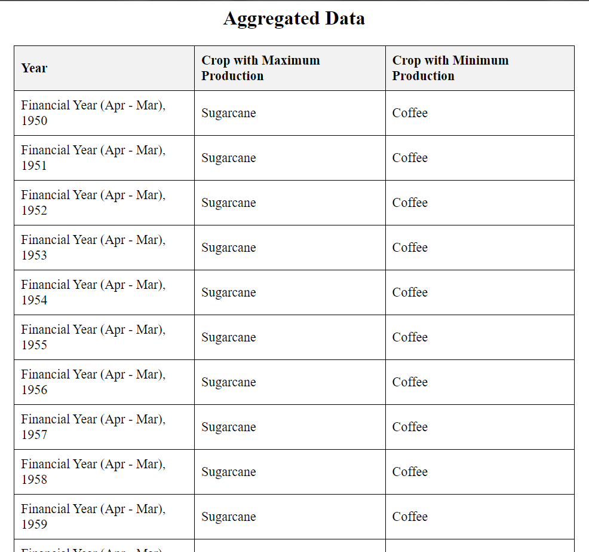
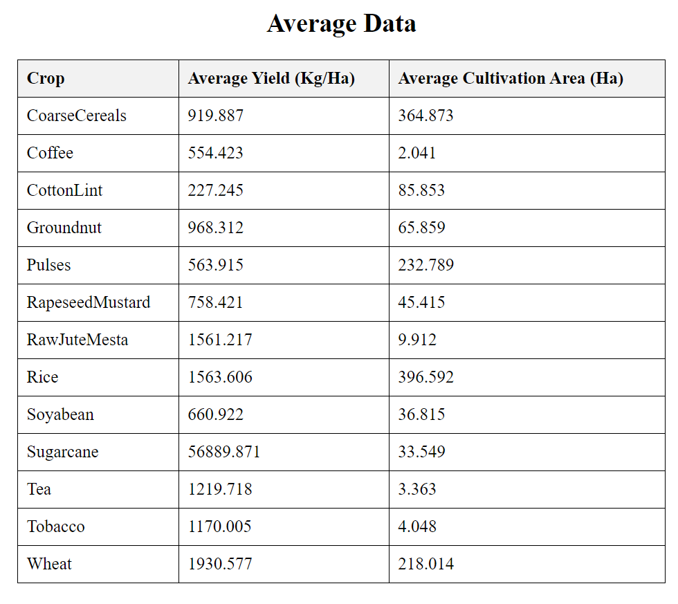

# Getting Started with Create React App

# Agriculture Data Processing

This repository contains code to process agriculture data from a JSON file (`agriculture_data.json`) to derive aggregated and average statistics per year and per crop.

## Requirements

- Node.js (version Latest)
- TypeScript (version latest)

## Installation

1. Clone the repository:
   This project was bootstrapped with [Create React App](https://github.com/shahhussainsa/IndianAgricultureDataset/).

## Install Yarn

Here are the steps to install Yarn and proceed with the project setup:

Option 1: Using npm
If you have npm installed (which comes with Node.js), you can install Yarn globally using npm:

### `npm install -g yarn`

Once Yarn is installed, verify the installation by running:

### `yarn --version`

### `Step 2: Create a React Project with TypeScript Template`

After installing Yarn, create a new React project using the TypeScript template:

### If creating New Project OR Access the folder usinf cd
#### `yarn create react-app indian-agriculture-analytics --template typescript`

Cd To Your Folder:

### `cd indian-agriculture-analytics`

### `Step 3: Install Mantine`

Install Mantine for creating tables:

### `yarn add @mantine/core @mantine/hooks`

### `Step 4: Load and Process Data`

Create a file named dataProcessing.ts in the src directory to handle data loading and processing:

### `Step 5: Create Tables`

Use Mantine to display the tables in App.tsx:

### `Step 6: Finalize the Project`

Ensure everything runs correctly:

### `yarn start`

Runs the app in the development mode.\
Open [http://localhost:3000](http://localhost:3000) to view it in the browser.

### `ScreenShots`

## `Aggregated Data Table`

## `Average Data Table`

The page will reload if you make edits.\
You will also see any lint errors in the console.
